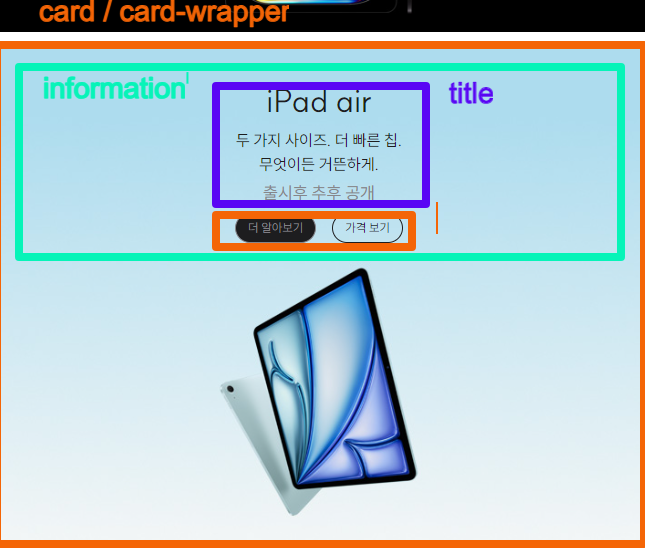
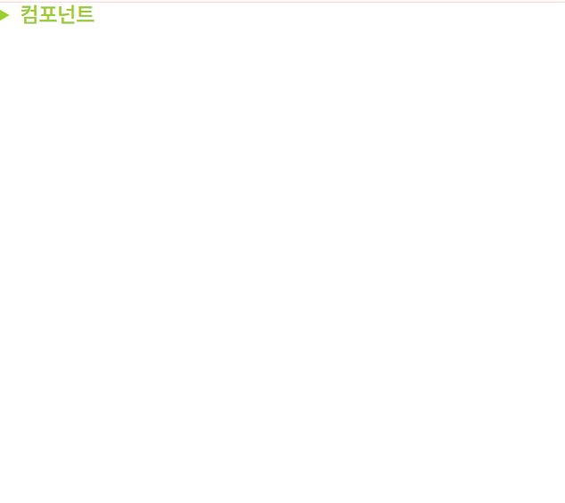
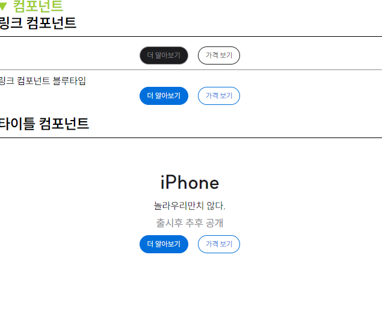
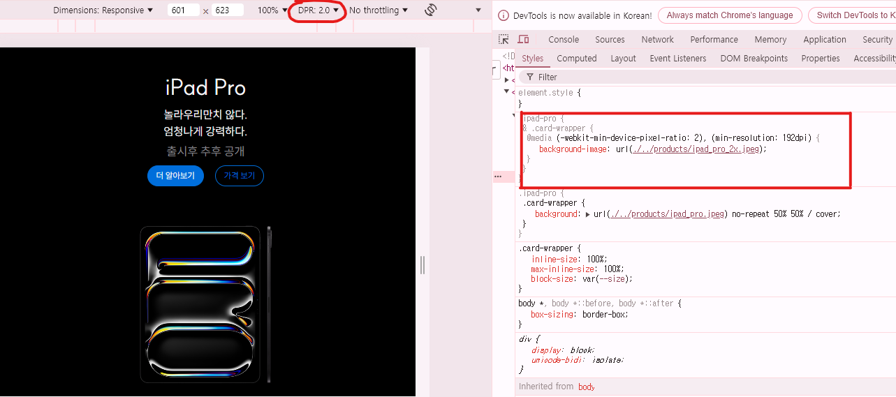
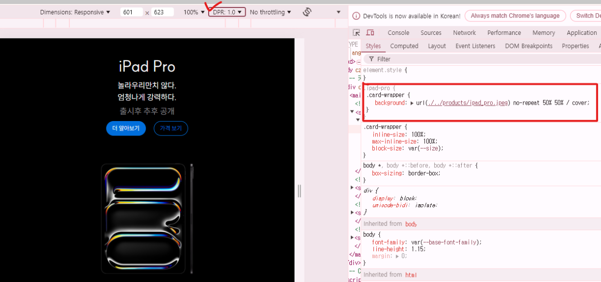

# apple 제품 카드

1. [과제 시작](#과제-시작)
2. [코드 설명](#코드-설명)
3. [스타일링 설명](#스타일링-설명)
4. [결과 화면](#결과-화면)
5. [결론 및 후기](#결론-및-후기)

## 과제 시작

이번 과제는 `grid`를 이용하여 유연한 레이아웃을 만드는 과제고, 반응형에 사이즈에 맞춰 조금씩 레이아웃 구조가 달라지는게 주요하다고 보면 되겠다.

## 코드 설명

### structure (마크업 구조)

<br>
먼저 마크업은 전체를 단순히 그룹핑의 목적으로 `card`라는 `<div>`요소로 묶고, 그 안에 `card-wrapper`로 한번 더 감쌌으며 `card-wrapper`에는 `background`로 백그라운드 이미지를 넣었고, 하위로 제목과 링크 버튼의 컴포넌트를 마크업하였다.

### Components (컴포넌트)




일단 `components.html`을 따로 만들어 `apple.html`에는 불필요한 컴포넌트 마크업이 없게 분리하였다. 특별히 그냥 의미를 준건 아니고, 선생님께서 짧게나마 가르쳐주신 요소를 사용하고자 `details , summary` 요소를 사용해서 그 안에 컴포넌트를 넣어봤다.

`details`만 사용하면 `mark`표시만 존재하고, `summary`를 함께 텍스틀 입력하면 제목 역할을 하여 클릭하면 그 안의 내용들을 접었다 폈다 할 수 있다. `details` 안에 `summary` **형제** 구조로 컴포넌트 마크업을 하면 된다.

#### 1️⃣링크 컴포넌트

`.link-wrapper`

> 누군가는 `button`이라고 볼 수 있겠지만 일단 페이지의 이동이 있어 보여 `a` 요소로 마크업을 하였다. 페이지 이동이 있는 인터렉션을 사용할 때는 `a` , 페이지 이동이 없는 인터렉션을 사용할 때는 `button`이라고 이해하면 되겠다.
>
> > 나는 이 링크에서도 기본타입과 파란색 버튼의 타입을 구분하면 좋을 것 같다고 생각하였다. 그래서 기본타입을 먼저 마크업 한 뒤 파란색 타입을 `link-wrapper`라는 클래스에 `&.blue-type` 이라는 클래스를 추가해주어 파란색 타입에서만 사용하는 스타일링을 추가해주었고, `html` 상에서는 `blue-type` 마크업만 함께 추가해주면 적용이 된다. `유틸리티-퍼스트` 방식으로 접근했다고 보면 될 것 같다.
>
> > 💡유틸리티-퍼스트 : CSS를 직접 작성하는 대신, 필요한 기능을 하는 클래스를 HTML 요소에 추가하는 방식.

#### 2️⃣제목 컴포넌트

`.title`

```html
<div class="title">
  <h2 class="title__main">iPad Pro</h2>
  <p class="title__sub">놀라우리만치 않다.<br />엄청나게 강력하다.</p>
  <p class="title__announcement">출시후 추후 공개</p>
</div>
```

> `BEM` 기법을 활용하여 class를 적용해봤고,이것이 sass에서는 아주 간편하지만 한편으로는 중첩이 많아지다 보면 조금은 구조가 복잡해 질 수 있는데 그래도 명확하게 컴포넌트를 분리한다면 그 안의 중첩이 되어도 복잡해지지 않을 것 같다고 느꼈다. `BEM`으로 class를 작성한 이유는 각각의 제목,부제목,추가텍스트 이렇게 모두 스타일링이 다르게 적용이 되어야해서 작성해봤는데 뭐 물론 요소 선택자로 작성을 못하는건 아니였다. `h2, p, p~p, p:nth-of-type(number)` 등등 있겠지만 각각 class가 있으면 의미가 명확해질 것 같아서 작성해봤다.

```css
:has(.card) {
  &.ipad-pro,
  &.iphone-pro,
  &.watch,
  &.airpods-pro {
    .title {
      color: var(--white);
    }
  }
}
```

> 또 title color도 밝은색 배경이미지에서는 어두운 color, 어두운색 배경이미지에서는 밝은 color로 타입이 나뉘었지만 그냥 이부분은 :has를 연습삼아 작성해봤다. card라는 클래스를 사용하고 있는 부모요소에 title color를 따로 지정해주었다.

## 스타일링 설명

### 1️⃣.container

이번에 배운 컨테이너 쿼리를 이용하여 1024px 반응형을 유연하게 대응하고 싶어서 전체를 `.container`라는 class로 그룹핑 하였고, 이 부분에다가 `container-type`과 `container-name`의 축약표현인 `container: container / inline-size`만 스타일링 하였다.

### 2️⃣.main

나는 `main` 요소안에 `section`으로 구분하여 각각의 카드들이 배치 될 수 있게 작업하였다. 그리고 `main`에 `display:grid`를 추가하였고, **1024px보다 낮은 해상도에서는** 그냥 일자로 쭉 떨어지는 레이아웃이다 보니 `grid-template` 를 지정해준건 딱히 없었던 것 같다. 하지만 **1024px 해상도** 부터 가장 하단 `section`이 **2열로** 레이아웃이 변경이 되어 총 4개의 `section`으로 구분하였고, 마지막 레이아웃이 변경되는 `section`에는 `display:grid` , `grid-template-columns` 스타일링을 주었고, 총 4개의 `article`요소로 또 구분하였다.

### 3️⃣Apple 제폼 이미지는 `` 요소가 아닌 CSS의 background 속성을 활용하여 구현한다.이 때 디바이스의 픽셀 밀도에 따라 1배율 또는 2배율 이미지가 배경으로 반영되도록 한다.

이 부분은 배운적이 없는 내용이고, 선생님께서도 배우지 않은걸 하는게 과제라고 하여 한번 검색을 하고, 적용을 해봤다.

```css
.ipad-pro {
  .card-wrapper {
    /* 기본 배경 이미지 (1024px 미만, 1배율) */
    background: url("./../products/ipad_pro.jpeg") no-repeat 50% 50% / cover;

    /* 2배율 디바이스에서 1024px 미만 */
    @media (-webkit-min-device-pixel-ratio: 2), (min-resolution: 192dpi) {
      background-image: url("./../products/ipad_pro_2x.jpeg");
    }
    /* 1024px 이상, 기본 배경 이미지 */
    @media (min-width: 1024px) {
      background-image: url("./../products/ipad_pro_wide.jpeg");
    }
    /* 2배율 디바이스에서 1024px 이상 */
    @media (min-width: 1024px) and (-webkit-min-device-pixel-ratio: 2), (min-width: 1024px) and (min-resolution: 192dpi) {
      background-image: url("./../products/ipad_pro_wide_2x.jpeg");
    }
  }
}
```

> 일단 기본 배경이미지를 설정할 곳에 `background` 축약표현으로 스타일링을 하였고, 픽셀 밀도에 따라 1배율 이미지 2배율 이미지가 설정이 되도록 해봤다.

#### 💡 @media (-webkit-min-device-pixel-ratio: 2), (min-resolution: 192dpi){}

`-webkit-min-device-pixel-ratio: 2` : 웹킷 기반 브라우저에서 픽셀 비율이 2 이상인 고해상도 디바이스를 타겟.

`min-resolution: 192dpi` : 모든 브라우저에서 해상도가 `192dpi` 이상인 디바이스를 타겟.

#### ❓❔ 그렇다면 둘 중 하나만 사용해도 되는가?

브라우저마다 지원하는 방식이 다를 수 있기 때문에 하나만 사용하는 건 불완전할 수 있다.
`구형 웹킷 기반 브라우저` , `최신 브라우저` 모두 지원하는 **폭넓은 브라우저 호환성**을 위해, 두 조건을 모두 사용한 것이 가장 안전하다고 볼 수 있다..

#### 적용 화면

**2배율 이상에서의 이미지**
<br>
**1배율에서의 이미지**


#### ❓❔ min-resolution: 192dpi인 이유는?

여러가지 이유가 있지만 가장 눈에 들어온건 `표준화`이다.
CSS에서 고해상도 이미지를 적용하기 위한 `min-resolution`속성이 도입되면서, `192dpi`가 일반적인 기준으로 잡게 되었다. 이 값은 다양한 디바이스에서 일관된 품질의 이미지를 제공하기 위해서 사용된다고 한다. 물론 필요에 따라서 이 값을 조정할 수는 있지만 기본적으로 `192dpi`는 고해상도 이미지에 적합한 범위로 널리 사용되고 있다고 한다.

## 결과 화면

https://github.com/user-attachments/assets/a21a455c-8bcc-48b6-baf3-d2be6c563607

## 결론 및 후기

`grid`를 활용하여 더 복잡한 과제를 하면 더 `grid`에 대한 이해도가 높아질 것 같았지만 그래도 반응형에 익숙해지고 있다는 것에 대해 좀 더 포커스를 맞춘 과제가 아닐까 싶다. `grid`를 활용한 마크업은 선생님이 주신 `Figma` 디자인 시안을 활용하여 좀 더 스스로 연습을 해야 하지 않을까 싶고, 그래도 한번도 배워보지 않았던 배율에 맞춘 속성을 검색하고, 활용하고, 궁금증을 가지면서 좀 더 성장한 시간이 아니였나 싶다. 선생님께서 말하시길 `CSS`는 정답이 없다. 어떻게든 구현을 하는게 의미가 우선적으로 있다고 하셨는데 이번과제 역시 마크업을 최대한 시멘틱하게 구현하고 있고, 컴포넌트에 대해서 고민을 하는 그런 부분이 또 성장하고 있다고 느끼지만 100프로 스스로가 확신을 하지 못하는 부분에서는 좀 더 연습이 필요하다고 느끼고 있다. html, css 마지막 과제인 만큼 최선을 다해보고 싶었는데, 컨디션 조절 문제로 인해 최선의 노력은 쏟아내지 못한것 같아 아쉽다. 하지만 선생님께서 주신 가르침을 늘 되새기면서 마크업,스타일링을 하는 노력을 기울여야 할 것 같다고 느꼈다.

### 추가로 해결하지 못한 궁금증

이번 카드 컴포넌트를 `a`요소로 묶고, 그 안에 컴포넌트들을 배치하려고 했는데 원래는 `html5` 이전에 즉, 컨텐츠 모델 적용 전에 `a`태그는 단순히 `inline` 태그였기 때문에 `a` 안에 `div`나 다른 영역들을 넣는 것은 표준에 어긋나는 일이었다. 그렇기 때문에 `a` 태그로 감싸는 영역을 만들 숙수가 없었는데, HTML5에 들어서 태그들이 단순히 `inline`, `block`으로 나누는게 아니라 태그의 성격과 특성에 따라 나누게 되었고, **a태그가 flow content를 품을 수 있게 되었다.** 그래서 `a`태그는 단순히 인라인 속성만 담을 수 있는 태그가 아닌 블록 요소까지도 담을 수 있게 되었다고 알고 있는데, 이번에 태그를 a로 감싸면 자꾸 그 영역을 제대로 잡지 못할 뿐더러 개발자도구 마크업 상에서 오류가 있었고, vscode 마크업상에서는 눈이 빠져라 확인을 하여도 원인을 찾치 못하였다. `a`태그에 `display:block` 지정을 해주면 된다는 글을 보기도 했는데, 잘 적용되지 않았다. 심지어 a태그를 감싸고 **html 유효성검사를** 하면 `a`태그의 대한 부분이 에러가 나 결국 어떠한 원인도 찾지 못하고, 과제 시간을 너무 많이 빼앗겨 일단은 `div`로 작업을 그룹핑하여 작업했던 것 같다. 내가 알고 있는 지식을 활용해도 오류가 있는게 너무 답답하였고, 찝찝하게 마무리된 과제인 것 같아 아쉬움이 크다.
