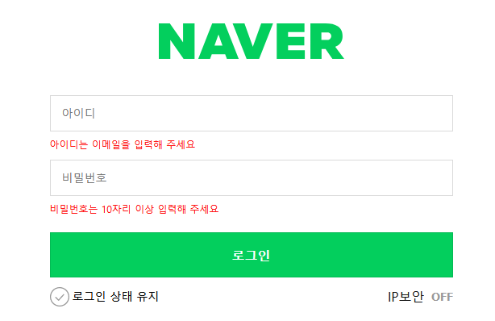

# Login 과제

1. [과제 시작](#과제-시작)
2. [코드 설명](#코드-설명)
3. [스타일링 설명](#스타일링-설명)
4. [결과 화면](#결과-화면)
5. [결론 및 후기](#결론-및-후기)

## 과제 시작

이번 과제는 사실 스크립트를 사용해야 하는 경우가 좀 있었어서 난이도가 생각보다 어려웠던 것 같다.
솔직히 내가 작성한 스크립트 코드는 조건문을 사용한 코드가 있었는데 별로 어렵게 작성하지 않았는데 여러가지 방해물(?)이 있었지만.. 뒷내용은 결론 및 후기에 자세하게 작성하도록 하겠다.

아무튼 이번 과제에서 가장 중요한 건 반응형 스타일링과 로그인 폼 스타일링, `flex` 그리고 효율적인 마크업이 아닐까 싶다. 그래서 이부분을 좀 더 중점적으로 회고하는 시간을 가져 보겠다.

## 코드 설명

### Components (컴포넌트)


> 1. login-wrapper (로그인 전체 컴포넌트)
> 2. brand (로고 컴포넌트)
> 3. login-form (input 입력 서식 컴포넌트)
> 4. state-form (상태유지 및 ip보안 컴포넌트)
>
> - keep (체크박스 컴포넌트) / security (토글 컴포넌트)

### login-wrapper

> 전체 컴포넌트를 이번에는 `div`에 `login-wrapper`라는 `class`를 부여해서 잡았던 것 같다.

### brand

> - 로고는 이미지를 포함하여 작업 할 때는 주로 웹 사이트 내에서 **`h1`** 태그로 감싸고 링크를 해당 홈페이지 URL로 이동 될 수 있게 그 안에 **`a`** 태그안에 이미지 태그 **(svg,png,img)** 를 넣어 작업한다. 나 또한 그렇게 구조를 잡아봤다.

### login-form

> **`form`** 태그로 묶었고, `input,label,p,button` 형제 관계구조로 총 입력서식 두개가 반복되도록 작성했다. 딱히 각각 input영역에 컴포넌트 분리를 시키지 않은 이유는 분리를 해서 스타일링을 따로 줘야한다는 느낌을 받지 못했고, 모두 동일하기도 했고 login-form자체를 컴포넌트로 봤다. button만 또 어디에선가 사용될 수도 있을 것 같아서 컴포넌트 분리를 시킨 것 같다.

### state-form

> 여기선 시안 상 스타일링이 따로 필요하기도 해보였고, 체크되는 아이콘, 그리고 토글되는 항목 이 부분들은 또 어디선가 쓰임이 있을 것 같아 컴포넌트 분리를 `.keep / .security` 이렇게 했던 것 같다.
> `.keep` 로그인 상태 유지를 `label`로 작업하여 `input`은 화면에서 숨기고, `label` 요소에 커스텀을 했다.
> `.security` 여기서는 IP보안을 누르면 해당 파일로 이동을 해야 했기 때문에 `a` 태그를 이용했고, on, off 스위치 인것 같아서 버튼으로 클릭시 on,off 전환되게 작업했다.

<br>

## 스타일링 설명

전체적으로 이번 과제에서 난 `@layer` 를 이용해서 css를 스타일링 도전해보고 싶어 기존에 선행을 했던 걸 참고하여 css를 작성했다. 또 작명할 때 앞에 글자를 대문자로 한 이유는 구분하기 쉽게 일관성을 부여했다.

<br>

> 일단 변수를 저장하는 **Variable** , 리셋css인 **Reset** , 레이아웃을 작성한 **Layout** , 컴포넌트를 작성하는 **Components** 그리고 그안에는 또 세부 컴포넌트별로 layer를 작성했고, 접근성 스타일링을 추가하여 작업할 수 있는 **Accessibility** 라는 `@layer`를 나눠 작업했다.

기존에 난 퍼블리셔로 근무 했을 때 CSS 논리속성을 거의 사용을 하지 않았던 것 같다. 그래서 이번 작업은 모두 CSS논리속성으로 작업했고, 이제 좀 익숙해 진것 같아 좋았다.

하나하나 모두 스타일링을 회고하기에는 너무 방대하여 그래도 설명을 꼭 해야하는 중요부분을 찝어 회고하도록 하겠다.

### @layer Variable

```css
@layer Variable {
  :root {
    --focus-border-color: #24388d;
    --button-bg-color: #03cf5d;
    --input-border-color: #dadada;
    --white: #fff;
    --gray99: 999;
  }
}
```

> 여기선 자주 사용하는 변수를 전역변수로 지정했다.

<br>

### @layer Reset

> 가장 대중적인 에릭 마이어 리셋을 임의로 가져와서 붙혀서 약간의 부족한 부분을 커스텀했다.
>
> > 대표적으로 `button`을 `all : unset` 처리 하지 않았다. 그 이유는 버튼의 모든 부분을 리셋하기 때문에 좀 불편했고, 남아있어야 속성이 있었기 때문에 없앨 부분만 리셋에 추가했다.

<br>

### @layer Layout

```css
:is(.login-wrapper, .login-form) {
  display: flex;
  flex-flow: column wrap;
  justify-content: center;
  align-items: center;
}
.error-message {
  align-self: start;
}

.login-wrapper {
  --minwidth-content-size: 290px;

  padding: 4.375rem 1.25rem 6.9375rem;
  min-inline-size: var(--minwidth-content-size);

  @media (min-width: 768px) {
    inline-size: 500px;
    margin-inline: auto;
  }
}
```

> 이 부분에서 가장 대표적으로 설명할 부분은 레이아웃이다. 전체 `login-wrapper`를 `display : flex` 열방향으로 떨어져야 했기 때문에 `flex-flow: column wrap;`을 주었다. 선생님께서도 `flex-flow`를 많이 사용한다고 하셨는데 나도 이걸 기본으로 사용할 정도로 많이 사용해서 반가웠다. 전체를 가운데 정렬하고, 좌측 우측으로 정렬이 되어야 하는 자식요소는 `align-self: start;`로 지정해서 주었다.
>
> > `login-wrapper` 와 중복되는 레이아웃 스타일링 구조가 있어서 `is()선택자`를 사용하여 작업했다.
> > 모바일에서 form contetn 최소 가로 넓이가 290px 인 것으로 확인되서 변수로 사이즈를 ` --minwidth-content-size: 290px;`로 공통 최소 가로 사이즈를 지정했고, `@media`쿼리를 이용해서 데스크탑 화면에서는 form 가로 사이즈를 따로 지정해 주었다.

<br>

### @layer Compoents

여기서는 `@layer Form` , ` @layer Error` 이 두가지를 꼭 설명해야 한다고 생각했다.

#### @layer Form

##### login-form

> 유연한 레이아웃을 가지기 위해서 ` flex: 1; width: 100%;`로 처리했고, `&::placeholder , &:focus`를 이용해서 `placeholder`와 `focus`를 커스텀하였다.

```css
@layer Form {
  .login-form {
    flex: 1;
    width: 100%;
    margin-block-start: 2.8125rem;

    input {
      &::placeholder {
        color: var(--gray99);
        font-size: 0.875rem;
        font-weight: 400;
      }
      &:focus {
        border-color: #03cf5d;
        background-color: #e9f0fd;
        outline: none;
      }
    }
  }
}
```

##### state-form

> 사실 난 `form`에선 여기가 가장 하이라이트이지 않을까 싶다 별거 없어보여도 설명할게 너무 많다.
>
> > .state-form은 일단은 데스크탑에서 봤을 때 두가지 컨텐츠가 존재하고, 모바일 환경에서는 로그인 상태 유지만 나오는 걸 알 수 있다. 이걸 어떻게 작업하지 생각하다가 일단 모바일에서도 데스크탑에서 화면처럼 작업 한 이후에 모바일에서 나오지 않아도 되는 부분을 (.security) `visibility: hidden;`처리하고, `@media` 쿼리를 이용해 데스트탑 환경에서 `visibility: visible;` 하였다. 또 심지어 로그인 상태 유지는 모바일에서는 우측에 있다가 데스크탑에서는 우측에 IP보안 OFF 텍스트가 생기면서 좌측으로 이동된다. 나는 여기서 `flex`를 사용했고, `justify-content: space-between;`를 이용하여 가장 사이드 끝으로 컨텐츠를 배치했고, `order`를 이용하여 모바일 기기 데스크탑 환경에 맞게 변경해주었다. 로그인 상태 유지는 처음에 우측에 있어야 하기 때문에 0보다 뒤인 `order:1;` 을 주어 우측에 배치했고, 데스크탑에서는 다시 좌측에 있어야 하기 때문에 `order:0;`을 주었다.
>
> > 로그인 상태 유지 부분에서 체크 되었을 때 아이콘 변경하는 부분은 일단 `input`을 활용하지는 않았고, `label`로 작업했다. `input`은 숨김 스타일링을 지정했고, 형제 요소인 `label`을 지정해주기 위해 `+ label`로 스타일링을 했다. `background` 속성을 사용하기 위해서는 `display: block`의 성질을 가지고 있어야 하는데 텍스트와 아이콘이 열로 지정되어야 하기 때문에 block의 성질을 가지지만 레이아웃은 열방향으로 나올 수 있는 ` display: inline-block;`을 설정했고, 가로, 높이 크기가 존재해야 하기 때문에 지정해주고 이부분에는 default 이미지 (비활성화) 아이콘 이미지를 설정했다. 그리고 활성화 이미지는 `&:checked {+ label {스타일링}}` 선택자를 이용하여 안에 활성화된 `background`요소를 추가해주었다.
>
> > 우측에 on off 버튼은 자바스크립트 클릭 이벤트를 이용했다.

```css
@layer Form {
  .state-form {
    display: flex;
    width: 100%;
    margin-block-start: 0.625rem;
    justify-content: space-between;

    .keep {
      order: 1;
      input {
        overflow: hidden;
        display: block;
        position: absolute;
        border: 0;
        inline-size: 1px;
        block-size: 1px;
        clip: rect(1px, 1px, 1px, 1px);

        + label {
          display: inline-block;
          padding-inline-start: 1.75rem;
          inline-size: 100%;
          block-size: 1.5rem;
          font-size: 0.875rem;
          background: url(./../../assets/login/unchecked.png) no-repeat;
        }
        &:checked {
          + label {
            background: url(./../../assets/login/checked.png) no-repeat;
          }
        }
      }

      @media (min-width: 768px) {
        order: 0;
      }
    }
    .security {
      display: flex;
      flex-flow: row nowrap;
      align-items: center;
      gap: 0.5rem;
      visibility: hidden;

      @media (min-width: 768px) {
        visibility: visible;
      }
    }
  }
}
```

##### Mobile

<br>

##### Desktop


## 결론 및 후기

일단 이번 과제는 난이도가 급상승한건 있지만 신경써야 하는 부분이 굉장히 많았어서 좀 시간이 걸렸던 것 같다. 솔직히 좀 쉽게 생각했던 부분도 없지 않아 있어 하루 중 저녁으로 미루고 작업을 하다 보니 새벽까지 작업을 하는 것 같다. 이번 과제에서 딱 구현하지 못한 한가지 부분은 `focus` 다른 focus는 했는데 로그인 상태 유지 아이콘으로 가는 `focus`기능을 구현하지 못한 것 같다. 계속 구글링하고 ai도움을 받았는데도 되지 않자 일정 부분 포기를 하고, 다른 부분에 더 신경을 썼던 것 같다. 지금 이 후기에는 `html,css`보다 관련하여 자바스크립트에서의 문제점 부분을 `input` 속성에 병합하여 좀 다뤄보고 싶다.

> 해당 과제 조건 부분에서 로그인 버튼을 클릭 시 폼이 제출(전송)이 되면서 공백으로 입력하거나 조건을 충족하지 못할 때 `input`양식 밑으로 에러 메시지가 작성이 되어야 한다. 아래 이미지를 참고하여 보여주겠다.

#### 시안

<br>

#### HTML

```html
<form action="/" method="post" class="login-form" id="loginForm">
  <input type="text" class="login-form__username" id="username" name="username" placeholder="아이디" required />
  <label for="username" class="sr-only">아이디</label>
  <p id="usernameError" class="error-message">아이디는 이메일을 입력해 주세요</p>
  <input type="password" class="login-form__password" id="password" name="password" placeholder="비밀번호" required />
  <label for="password" class="sr-only">비밀번호</label>
  <p id="passwordError" class="error-message">비밀번호는 10자리 이상 입력해 주세요</p>
  <button type="submit" class="btn-login green" id="loginButton">로그인</button>
</form>
```

> 일단 마크업은 이렇게 작성했다. input과 label 밑에 와야하기 때문에 p태그로 작성을 했다.

#### CSS

```css
@layer Error {
  .error-message {
    --error-text-color: #ff1414;

    overflow: hidden;
    align-self: start;
    opacity: 0;
    block-size: 0;
    color: var(--error-text-color);
    font-size: 0.75rem;
    transition: opacity 0.3s ease, height 0.3s ease;
    line-height: 1.125rem;
    padding-block-start: 0;
  }
}
```

> 에러 메시지는 일단 화면상에서 숨김 처리를 하고 영역, 여백도 잡히지 않고 있다가 스크립트를 활용하여 노출되면서 영역도 잡고 여백도 잡는식으로 스타일링 했다.

<br>

### 문제점

일단 내가 작업한 스크립트는 폼 제출 버튼을 유효한 양식에 맞춰 작업 하지 않으면 폼 전송을 막고, 에러 메시지를 보여주게 하는 건 기능적으로 구현을 잘한다. 하지만 과제 예시 gif와 비교해 봤을 때 초기 아무것도 입력하지 않은 공백 상태에서 폼 전송을 하면 기본 필수 알림만 뜨고, 에러 메시지가 작동이 되지 않는다. 그래서 `input` 속성에 `required`를 지우면 또 잘된다. 유효성 검사를 `required` 기본 유효성 검사를 하기 때문에 그런 거 같은데 그래서 ai를 이용해서 되게 복잡하게 작업이 되어있는걸 가져다 사용하니 잘되는것 처럼 보이다가 유효한 양식을 입력해도 에러 메시지가 없어지지 않았다.<br>

문제 원인은 `required`속성이 설정된 `input`이 브라우저가 기본적으로 제공하는 유효성 검사 기능을 통해 필수 입력 여부를 확인하는데 이 과정에서 JavaScript가 추가로 유효성 검사를 수행하면서 `event.preventDefault()`를 호출하면, 브라우저의 기본 유효성 검사가 수행되지 않을 수 있다고 한다. 폼 제출 시점에 JavaScirpt가 모든 유효성 검사를 완료한 후에 `event.preventDefault()`가 호출되면 `required`속성이 의도대로 작동하지 않을 수 있다. 즉, 사용자가 필수 입력 필드를 비워두고 제출할 경우, 오류 메시지가 표시되지 않고, 해당 입력 필드의 상태가 잘못 반영될 수 있다. 그래서 `required`속성과 충돌을 방지하고자 `setCustomValidity`메소드를 사용해봤지만 잘 안되었다..<br>

이런 오류가 작업 마무리까지도 확인하면서 보여서 다시 그냥 처음 상태로 돌렸던 것 같다. 아직 자바스크립트를 제대로 배우지 않았을 뿐더러 내가 알고있는 지식 선에 한계를 부딪혀 최대한 도움을 받아 작업을 해보려고 했으나 완벽하지 않고, 꼼수로 완성된 것 처럼 보여줄 바엔 그냥 내가 조금이라도 고민하고 짠 코드를 보여드리고 추후 자바스크립트를 배우게 되었을 때 다시 보완을 하자라는 생각으로 다음을 기약했다.

<br>

#### required를 포함한 채로 공백 상태에서 폼 전송을 했을 때

<br>

#### required를 포함한 채로 뭐라도 입력하고 폼 전송을 했을 때


#### required를 제거한 후 공백 상태에서 폼 전송을 했을 때


